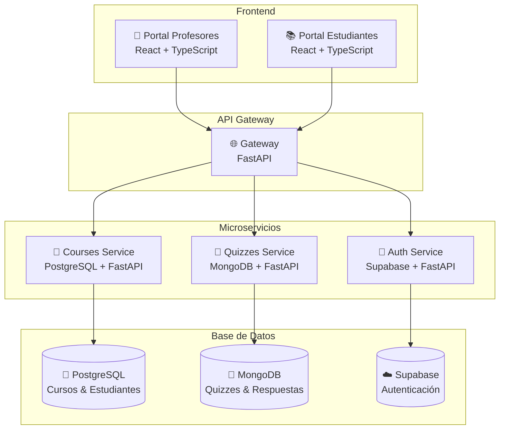

# 🎓 TeachMicroservices

<div align="center">


*Plataforma educativa moderna con arquitectura de microservicios para gestión de cursos y evaluaciones*

</div>

---

## 🌟 ¿Qué es TeachMicroservices?

**TeachMicroservices** es una plataforma educativa completa diseñada con arquitectura de microservicios que permite a **profesores** crear y gestionar cursos, mientras que los **estudiantes** pueden unirse y participar en evaluaciones interactivas en tiempo real.

### ✨ Características principales

- 👨‍🏫 **Portal de Profesores**: Gestión completa de cursos, estudiantes y evaluaciones
- 👩‍🎓 **Portal de Estudiantes**: Interfaz intuitiva para participar en quizzes 
- 🔐 **Autenticación Segura**: Sistema de auth con Supabase
- 📊 **Evaluaciones en Tiempo Real**: Sistema de quizzes con monitoreo live
- 📈 **Analytics y Reportes**: Seguimiento del progreso estudiantil
- 🚀 **Escalable**: Arquitectura de microservicios con Docker

---

## 🏗️ Arquitectura



---

## 🚀 Inicio Rápido

### 📋 Pre-requisitos

Asegúrate de tener instalado:

- 🐳 [Docker](https://docker.com) y Docker Compose
- 🔧 Git
- 🌐 Navegador web moderno

### ⚡ Instalación

1. **Clonar el repositorio**
```bash
git clone <tu-repositorio>
cd teach-microservices
```

2. **Configurar variables de entorno**
```bash
# Crear archivo .env en la raíz del proyecto
cp .env.example .env

# Editar .env con tus credenciales de Supabase
SUPABASE_URL=tu_supabase_url
SUPABASE_KEY=tu_supabase_key
```

3. **Levantar toda la aplicación** 🚀
```bash
docker-compose up -d
```

4. **¡Listo!** 🎉
   - **Portal Profesores**: http://localhost:5173
   - **Portal Estudiantes**: http://localhost:5174
   - **API Gateway**: http://localhost:8000

---

## 🎯 Cómo usar la plataforma

### 👨‍🏫 Para Profesores

1. **Registro/Login**: Accede al portal de profesores
2. **Crear Curso**: Añade un nuevo curso con estudiantes
3. **Subir Estudiantes**: Importa lista de estudiantes via CSV
4. **Crear Quiz**: Diseña evaluaciones con múltiples preguntas
5. **Monitorear**: Ve respuestas en tiempo real durante el quiz

### 👩‍🎓 Para Estudiantes

1. **Unirse al Quiz**: Ingresa el código proporcionado por el profesor
2. **Responder**: Completa las preguntas del quiz
3. **Ver Resultados**: Revisa tu puntuación al finalizar

---

## 🛠️ Servicios y Puertos

| Servicio | Puerto | Descripción |
|----------|--------|-------------|
| 🌐 **Frontend Profesores** | 5173 | Interfaz para gestión de cursos |
| 📚 **Frontend Estudiantes** | 5174 | Portal para participar en quizzes |
| 🚪 **API Gateway** | 8000 | Punto de entrada único para APIs |
| 🔐 **Auth Service** | 8001 | Gestión de autenticación |
| 📖 **Courses Service** | 8002 | Gestión de cursos y estudiantes |
| 📝 **Quizzes Service** | 8003 | Gestión de evaluaciones |
| 🐘 **PostgreSQL** | 5433 | Base de datos de cursos |
| 🍃 **MongoDB** | 27017 | Base de datos de quizzes |

---

## 🧪 Desarrollo

### Comandos útiles

```bash
# Ver logs de todos los servicios
docker-compose logs -f

# Ver logs de un servicio específico
docker-compose logs -f courses

# Rebuild un servicio después de cambios
docker-compose up --build courses

# Detener todos los servicios
docker-compose down

# Limpiar volúmenes (⚠️ Borra datos)
docker-compose down -v
```

### 📁 Estructura del proyecto

```
teach-microservices/
├── 🐳 docker-compose.yml           # Orquestación de servicios
├── 🔧 .env.example                # Variables de entorno ejemplo
└── 📂 backend/
    ├── 🔐 auth/                    # Microservicio de autenticación
    ├── 📖 courses/                 # Microservicio de cursos
    ├── 🌐 gateway/                 # API Gateway
    └── 📝 quizzes/                 # Microservicio de quizzes
└── 📂 frontend/                    # Portal profesores (React)
└── 📂 frontend-students/           # Portal estudiantes (React)
```

---

## 🤝 Contribuir

1. Fork el proyecto
2. Crea tu rama (`git checkout -b feature/AmazingFeature`)
3. Commit tus cambios (`git commit -m 'Add some AmazingFeature'`)
4. Push a la rama (`git push origin feature/AmazingFeature`)
5. Abre un Pull Request

---

## 📄 Licencia

Este proyecto está bajo la Licencia MIT - ver el archivo [LICENSE](LICENSE) para más detalles.

---

## 💡 Soporte

¿Tienes preguntas o problemas?

- 🐛 **Reportar bugs**: Abre un issue
- 💬 **Discusiones**: Usa las GitHub Discussions
- 📧 **Contacto directo**: [peraltajosue111@gmail.com]

---

<div align="center">

**¡Construido con ❤️ para la educación!**

⭐ Si te gusta este proyecto, ¡dale una estrella! ⭐

</div>